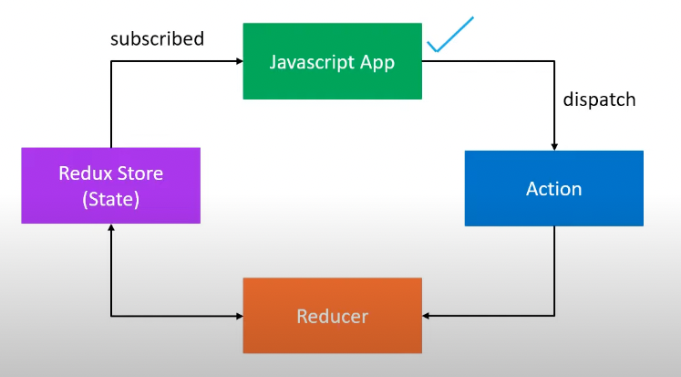

# Redux Tutorial

## Intro

- `What is Redux`: It is a predictable state container for JS apps
- `State Container`: It stores the state of the application, which is shared by all the individual components of that app.
- `Predictable`: A pattern is enforced to ensure all state transitions are explicit and can be tracked, hence making changes predictable.

- `What is Redux Toolkit`: It is the official, opinionated, batteries-included toolset for efficient Redux development. It is an abstraction on top of Redux to simplify development using Redux. The _React Redux_ connects Redux toolkit to React. It provides bindings to use React and Redux Toolkit together in an application.

## Redux

### Three Core Concepts

- `Store`: Holds the state of your application
- `Action`: Describes what happened in the application
- `Reducer`: Handled the action and decides how to update the state.

### Three Fundamental Principles of Redux

1. _The global state of your application is stored as an object inside a single store_. In other words, maintain the application state in a single object which would be managed by the Redux store.

2. _The only way to change the state is to dispatch an action, an object that describes what happened._ To update the state of your app, you need to let Redux know about that with an action. Directly updating the state object is not allowed.

3. _To specify how the state tree is updated based on actions, you write pure reducers._ Reducers are functions which take as parameter the previous state and the action and returns a new state.

<div style="text-align: center;">


</div>

## Actions

- Are the only way the application can interact with the store.
- Carry some information from the app to the Redux store.
- Plain Javascript objects.
- Have a type property that describes something that happened in the application.
- The type property is typically defined as string constants.
- Use action creators instead of directly passing the action object. This allows for easier changes down the line since the action is created from a single place.

## Reducers

- Specify how the app's state changes in response to actions sent to the store.
- Function that accepts state and actions as arguments, and returns the next state of the application.

## Redux Store

- One store for the entire application.
- Holds application state.
- Allows access to the state via `getState()`.
- Allows state to updated via `dispatch(action)`.
- Allows listeners via `subscribe(listener)`.
- Handles unregistration of listeners via the function returned by `subscribe(listener)`.

## Bind Action Creators

- Helps simplify the process of calling actions.
- Refer to [`index.js`](./redux-demo/index.js) for how to use them.
- They are not very neccesary though feel free to not use them if you do not like it.

## Using Multiple Reducers

- For the maintainability of the code, it is a good idea to have seperate reducers for different states. This helps debugging too by seperating concerns.
- To do this we need to combine the reducer to pass them to the createStore method.
- We can do that using the `combineReducer` method which takes an object contianing a key/pair value for each reducer.
- The convention is to call the combined reducer resulting from using combineReducer, `rootReducer`.

```js
const rootReducer = combineReducers({
    cake: cakeReducer,
    iceCream: iceCreamReducer
})
const store = createStore(rootReducer);
```

- The corresponding global looks as such:

```js
{ cake: { numOfCakes: 10 }, iceCream: { numOfIceCreams: 20 } }
```

- `cake` and `iceCream`correspond to the keys passed in the combineReducer method.

## The IMMER Library

- When working with complex states containing multiple nested objects, it can really complicated to updated the states in the reducers.
- The example below shows an example.

```js
const streetReducer = (state = initialState, action) => {
    switch(action.type) {
        case STREET_UPDATED:
            return {
                ...state,
                address: {
                    ...state.address,
                    street: action.payload
                }
            }
        default:
            return state;
    }
}
```

- To avoid the struggle of updating the states using the spread operator, we can use the `Immer` library.
- It has the `produce` method which takes two parameters, the current state and a callback which has as parameter the draft, which is like a mutable copy of the current state which allows us to modify it directly.

```js
const streetReducer = (state = initialState, action) => {
    switch(action.type) {
        case STREET_UPDATED:
            return produce(state, (draft) => {
                draft.address.street = action.payload;
            })
        default:
            return state;
    }
}
```

- Refer to [`nestedState.js`](./redux-demo/nestedState.js) for more details on the use of the immer library.

## Middleware

- It is the suggested way of extending Redux with custom functionality.
- Provides a third-party extension point between dispatching an action, and the moment it reaches the reducer.
- Use middleware for logging, crash reporting, performing asynchronous tasks, etc.
- An example is `redux-logger`.
- We can apply middleware by using the `applyMiddleware` method in redux, passed as the second parameter to the createStore function.

```js
const reduxLogger = require('redux-logger');
const logger = reduxLogger.createLogger();

...

const store = createStore(rootReducer, applyMiddleware(logger));
```

## Async Actions: Redux Thunk Middleware

- Sometimes you need to run some asynchronous code like fetching data from an API and in that case, the approach needs to change a little as regards the reducer.
- Here, we need to use the `Redux-Thunk middleware`.
- It is the standard way of defining async action creators.
- Typically, for data fetching, the state object in the store has 3 properties:
  - `loading`: Indicates whether the data is still being fetched or not. Helps display a loading spinner in the component.
  - `data`: Holds the fetched data.
  - `error`: Contains the error message in case the request fails. Can be used to display the error to the user.
- We are going to have 3 actions corresponding to the action itself, and the success or failure of the request. e.g
  - `FETCH_USERS_REQUESTED`: Fetch list of users
  - `FETCH_USERS_SUCCEEDED`: Fetched successfully
  - `FETCH_USERS_FAILED`: Fetched users failed
- To use it, you import it and pass it as a parameter to redux's applyMiddleware method, which itself is a parameter to the createStore method.

```js
const thunkMiddleware = require('redux-thunk').default;
const store = createStore(fetchUserReducer, applyMiddleware(thunkMiddleware));
```

- This then allows to use an action creator to return a function instead of an action. The function can perform side-effects suc as asynchronous tasks and dispatch regular actions based on logic, which will be handled by the reducer.

```js
const fetchUsers = () => {
    return (dispatch) => {
        dispatch(fetchUsersRequest())
        axios.get('https://jsonplaceholder.typicode.com/users')
            .then(response => {
                const users = response.data.map(user => user.id);
                dispatch(fetchUsersSuccess(users));
            })
            .catch(error => {
                dispatch(fetchUsersFailure(error.message))
            })
    }
}
```

- Then, to use the action creator, simply dispatch it using the store's dispatch method.

```js
store.dispatch(fetchUsers())
```

- For more details on how to use the redux-thunk middleware, refer to [`asyncAction.js`](./redux-demo/asyncAction.js).

# Redux Toolkit Tutorial

- This is still redux but fixes the following problems:
  - Too much boilerplate code.
  - A lot of other packages need to be installed to work with redux.
- Abstracts over the setup process.
- Handles the most common use cases.
- Includes some useful utilities.
- The file structure is important when using redux toolkit.
- Refer to the folder [`rtk-demo`](./rtk-demo/) for more details on pure RTK.

```system
rtk-demo
├── app
│   |── store.js
├── features
│   ├── cake
│   │   ├── cakeSlice.js
│   ├── icecream
│   │   ├── iceCreamSlice.js
├── dist (or build
├── node_modules
├── package.json
├── package-lock.json 
└── .gitignore
```

## Creating a Slice

- It is recommended to group the reducer logic and the action for a single feature in a single file.
- The name of that file should contain `slice`. e.g. `cakeSlice.js`
- For each feature, we need to create a slice using RTK's create slice method, which is going to contain the state, the action and the reducers for that feature.

```js
const createSlice = require('@reduxjs/toolkit').createSlice;

const initialState = {
    numOfCakes: 10
}

const cakeSlice = createSlice({
    name: 'cake',
    initialState: initialState,
    reducers: {
        ordered: (state) => {
            state.numOfCakes--
        },
        restocked: (state, action) => {
            state.numOfCakes += action.payload
        }
    }
})

module.exports = cakeSlice.reducer;
module.exports.cakeActions = cakeSlice.actions;
```

- Reducers are created in the `reducers` key and the value is an object. For each action, we create a key which corresponds to the action and the value is a function which executes the logic for that action returns the new state.
- Here, the state is mutable so it is a lot easier to modify the state in the reducer.
- The actions can be accessed using the `actions` property of the slice and the reducers can be accessed using the `reducer` property of the slice.

## Configuring the Store

- The store is configured in `app/store.js` file by convention.
- To define the store, we use the `configureStore` method.

```js
const configureStore = require('@reduxjs/toolkit').configureStore;
const cakeReducer = require('../features/cake/cakeSlice');

const store = configureStore({
    reducer: {
        cake: cakeReducer
    }
})

module.exports = store;
```

- We can now use the store and actions defined as shown in the example below.

```js
const store = require('./app/store');
const cakeActions = require('./features/cake/cakeSlice').cakeActions

console.log(store.getState())

const unsubscribe = store.subscribe(() => {
    console.log(store.getState())
})

store.dispatch(cakeActions.ordered())
store.dispatch(cakeActions.ordered())
store.dispatch(cakeActions.ordered())
store.dispatch(cakeActions.restocked(3))

unsubscribe();

```

## Middleware with RTK

- To use middleware, we import them, create an instance of them, then add them by concatenating them to the default middleware.
- This can be done as shown below:

```js
const reduxLogger = require('redux-logger');

const logger = reduxLogger.createLogger();

const store = configureStore({
    reducer: {
        cake: cakeReducer,
        iceCream: iceCreamReducer,
    },
    middleware: (getDefaultMiddleware) => getDefaultMiddleware().concat(logger)
})
```

## Extra Reducers

- With vanilla Redux, each reducer can only update its portion of the application state. For example, the cake reducer can only update the application state related to cakes. However, it can respond to any action dispatched to effect an update on its portion of the application state.
- This is because all the reducers recieve the dispatched action, but only reducers programmed to listen to that type of action will respond to the action.
- However, in RTK, that does not happen.
- By default, reducers from one createSlicer will only respond to actions generated by the same createSlice call.
- It is possible to change this behaviour by using extra reducers.
- Extra reducers are reducers which are not part of the reducers created by createSlice by default.
- This can be used in two ways:

```js
const createSlice = require('@reduxjs/toolkit').createSlice;

const initialState = {
    numOfIceCreams: 20
}

const iceCreamSlice = createSlice({
    name: 'iceCream',
    initialState,
    reducers: {
        ordered: (state) => {
            state.numOfIceCreams--
        },
        restocked: (state, action) => {
            state.numOfIceCreams += action.payload
        },
    },
    extraReducers: {
        ['cake/ordered']: (state) => {
            state.numOfIceCreams--;
        }
    }
})

module.exports = iceCreamSlice.reducer
module.exports.iceCreamActions = iceCreamSlice.actions
```

OR (This is the recommended way)

```js
const { cakeActions } = require('../cake/cakeSlice');

const createSlice = require('@reduxjs/toolkit').createSlice;

const initialState = {
    numOfIceCreams: 20
}

const iceCreamSlice = createSlice({
    name: 'iceCream',
    initialState,
    reducers: {
        ordered: (state) => {
            state.numOfIceCreams --
        },
        restocked: (state, action) => {
            state.numOfIceCreams += action.payload
        },
    },
    extraReducers: (builder) => {
        builder.addCase(cakeActions.ordered, (state, action) => {
            state.numOfIceCreams--;
        });
    }
})

module.exports = iceCreamSlice.reducer
module.exports.iceCreamActions = iceCreamSlice.actions
```

## RTK Async Actions

- We can also use asynchronous actions using RTK's `createAsyncThunk` method.
- The method takes two parameters, the action type and a callback, where the asynchronous code is executed is called.
- The method automatically generates the pending, fulfilled and rejected actions types.
